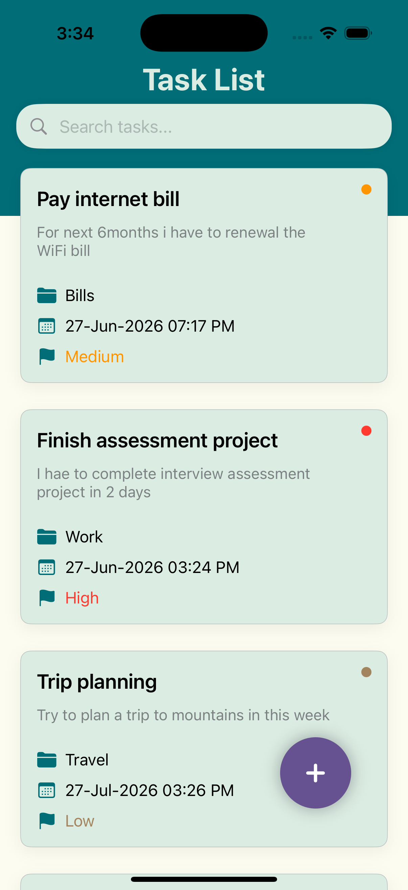
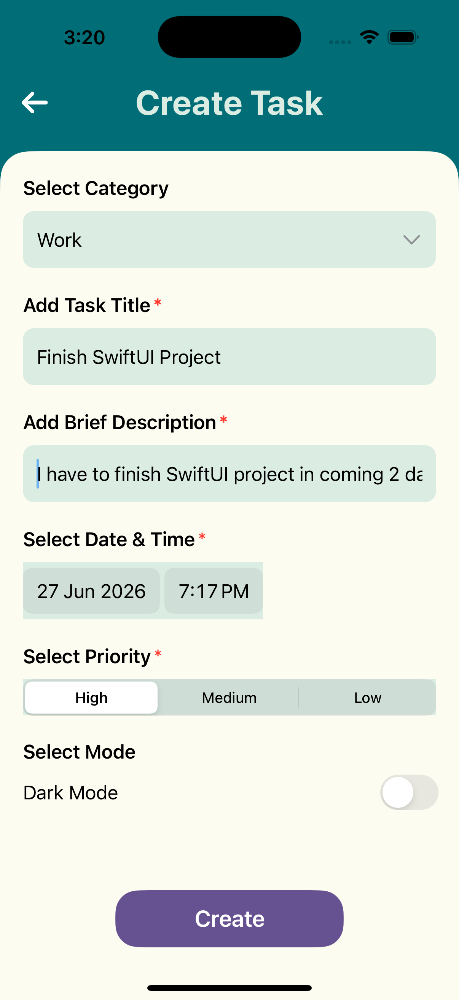
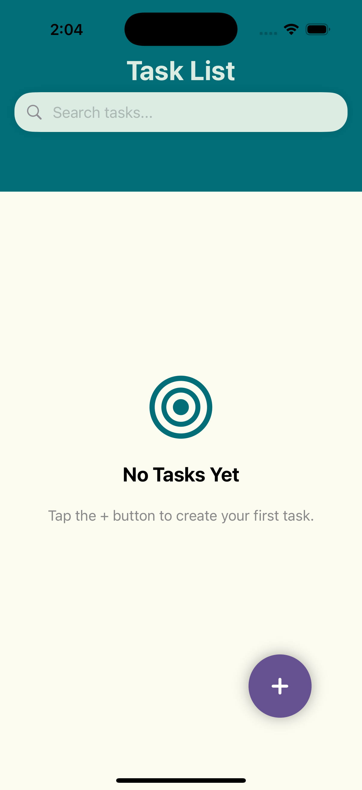
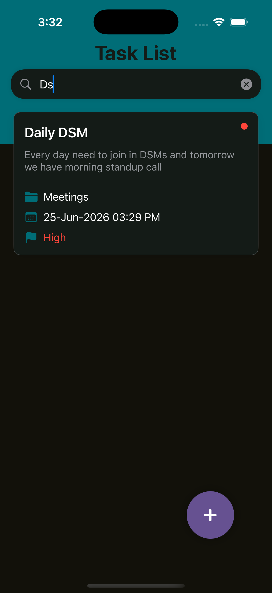
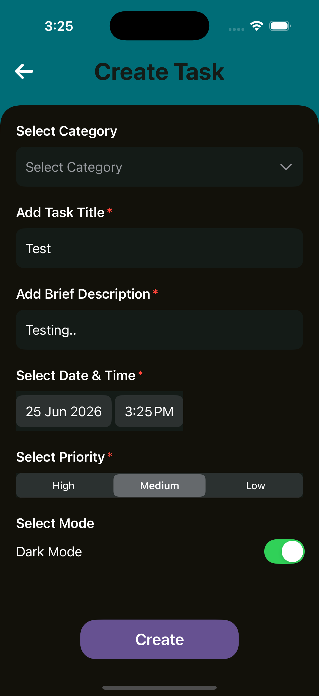
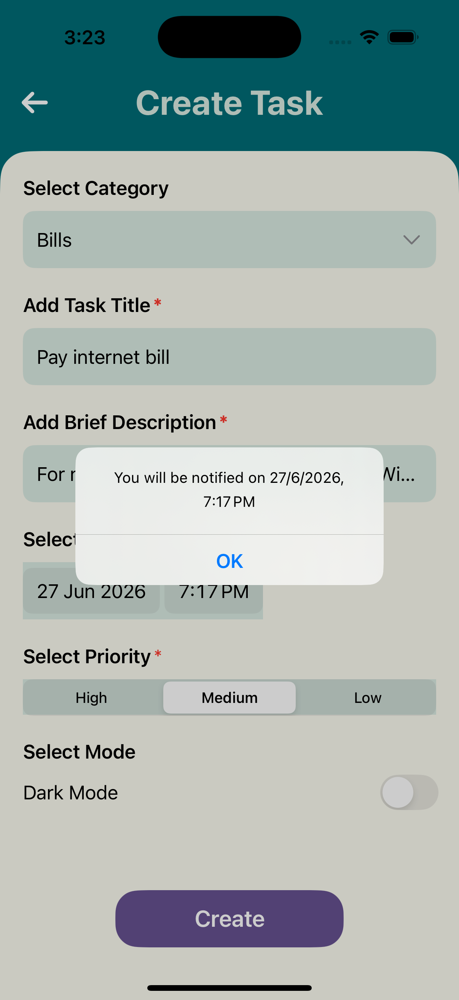

## About The Project

<h2>Screenshots</h2>

TaskMate is a task management application built with SwiftUI that helps users organize their daily activities efficiently. Users can create, delete, and search tasks while keeping track of priorities and deadlines.

The application follows the MVVM (Model-View-ViewModel) architecture to maintain a clean separation between the user interface, business logic, and data layer, making the codebase scalable and easier to maintain.

Tasks are stored locally using Core Data, ensuring that user data persists between app launches. The app also integrates Local Notifications to remind users about important tasks and deadlines.

To provide a better user experience, TaskMate supports both Light Mode and Dark Mode, adapting seamlessly to the system appearance. The interface is designed using SwiftUI, focusing on simplicity, responsiveness, and modern iOS design principles.

### Built With

* SwiftUI
* MVVM Architecture
* Core Data
* UserNotifications Framework

### Learning Objectives

This project was developed to gain hands-on experience with:

* Building modern iOS applications using SwiftUI
* Implementing the MVVM architectural pattern
* Managing local data persistence with Core Data
* Working with Local Notifications
* Supporting Light and Dark Mode themes
* Creating reusable and maintainable UI components

